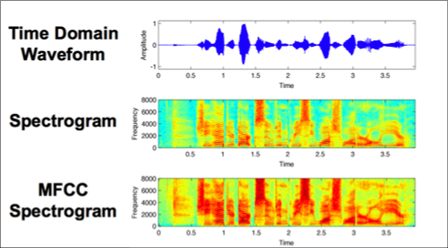
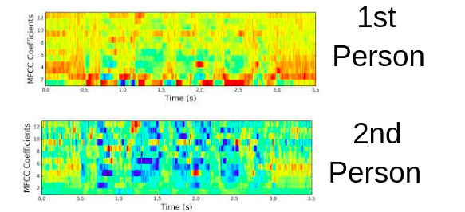
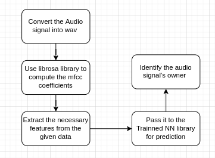
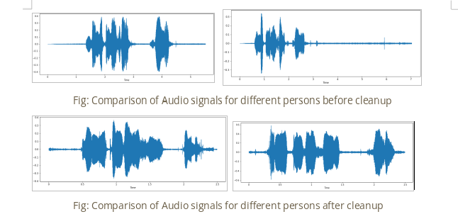
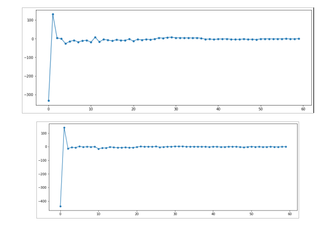
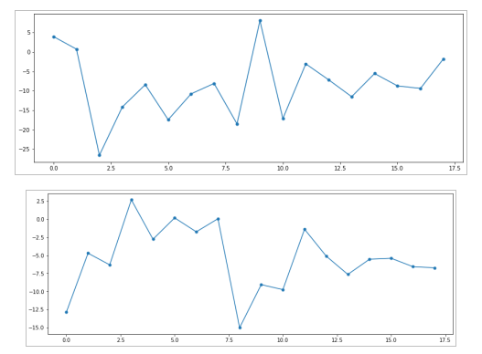

# ML_Voice_Classification
Human Voice Classification using MFCC Spectrogram

## MFCC:
---

The MFCC stands for Mel Frequency Cepstral Coefficients. These coefficients calculate the rate of change of the spectral bands in a given time signal. The MFCC is computed by applying a Fourier transform on the given signal and then applying the cosine transform of the logarithmic value of the Fourier spectrum. Generally speaking, the MFCC could differentiate the timbre of the given audio signal from another(11). Further, the MEL scale relates the frequency of the given signal as perceived by the user to another audio signal. The Mel scale can be used as a qualitative measure to compare two audio signals based on their MFCC score. 

### Amplitute vs Spectogram vs MFCC 

## Approach 
---

There are two approaches from here to classify signal 
    • Convolutional Neural Net
    • Classification based on MFCC Freq values

### CNN:
The approach is similar to image recognition, where we apply CNN on the MFCC spectral image to classify the audio based on training. 

### Classification based on MFCC Freq values

## Implementation
---

### Data Cleanup
The given data has varying time lengths for each person. as shown in the image below. To overcome this variance in the audio data, we have taken the middle 80% of the data from every user such that all the audio files will have more than 90% of waveform data for a time of 2.5s.

### Feature Extraction
From the MFCC coefficients, not all data will provide helpful information to classify one audio from another. For our model to achieve good accuracy, we have to select the input features properly. This is done by analyzing the plot of the mfcc coefficients and identifying which part of the input features has the highest variance to capture the difference.

#### Before Feature Extraction

#### After Feature Extraction

## Training a NN Model:
---

We use the MFCC coefficients from the previous step to train a Neural network. The trained neural network was able to predict the sample audio with an accuracy of 98%. WE will use the trained neural network to classify the unknown audio signal. 